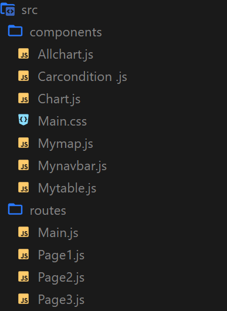

# 사업용 차량 :truck: 안전 위험 분석 웹서비스 프로젝트

사업용 차량의 운행기록을 바탕으로 차량 안전 관리정보를 보여주는 웹서비스입니다.

#### Project execution period : 2023.01.11~02.09

---

## Description

차량의 운전자 및 관리자를 위한 정보제공 시스템으로, 차량에 부착된 단말기로 운행정보를 읽어들여 차량 관리 및 안전 등급 등을 분석해서 알려준다.

## Fack-End Team:

- [김민수](https://github.com/Misnu0207)

## :pushpin:Requirements

FrontEnd

- React 18.2.0
- Node.js 16.17.1
- Visual Studio 1.75.1
  -axios 1.2.2,
  -reduxjs/toolkit 1.9.1,

BackEnd

- SpringBoot 4.16.1.RELEASE
- eclipse 4.25.0
- apache tomcat 9.0.67
- Java JDK 17 or higher
- Maven 3.0.1
- use MySQL database > JdbcTemplate

## :fire:Final Version

## :bookmark: Explanation

## :white_check_mark:What's missing
